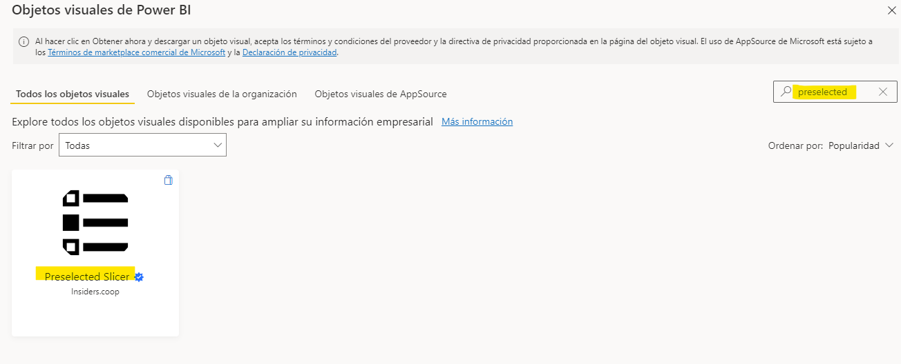
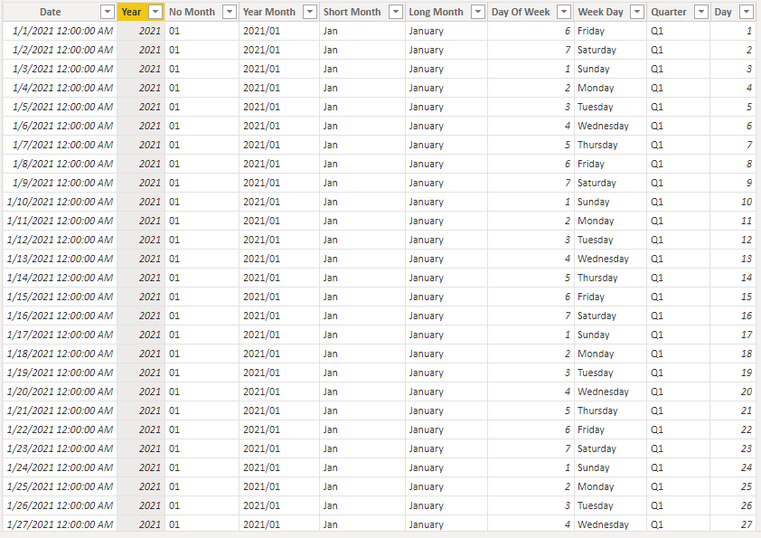
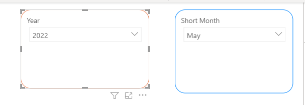
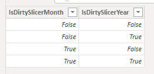
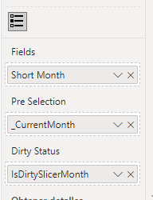
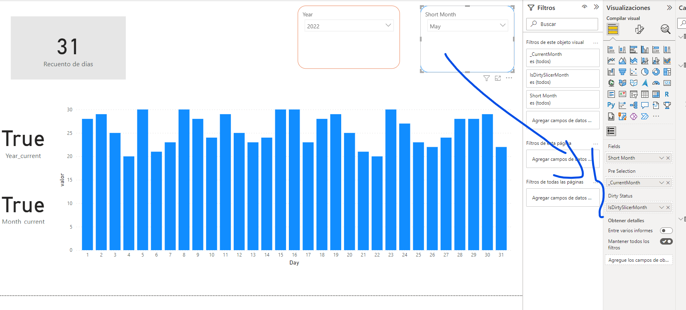
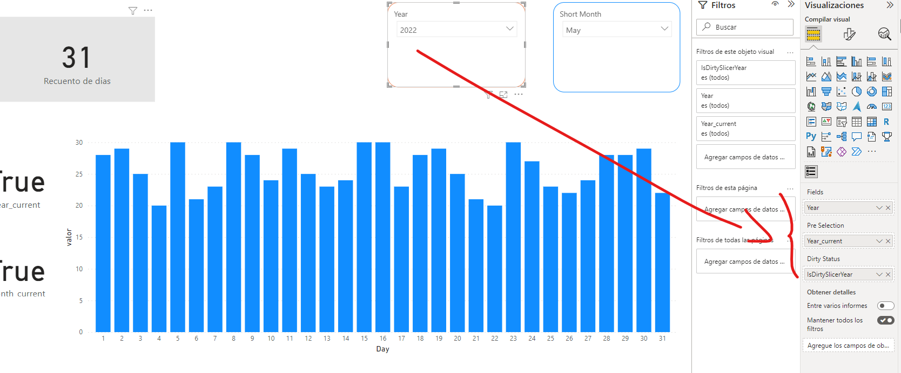

<!-- 2 <sup>n<sup/> para crear super indice -->
# ¿Cómo hacer que tu Reporte se filtre por la fecha actual de manera preseleccionada?
Me sucedió un escenario como en la pregunta.

 Resulta que un usuario quería que uno de los reportes se mande de forma automática desde el **servicio de Power BI**, pero siempre con el reporte filtrado con los datos a la fecha actual, **específicamente mes y año actual**.
Se llegó a la solución en su momento, pero no fue tan simple. En la actualidad existe un objeto visual llamado: **Preselected Slicer**, el cual nos permite realizar esta funcionalidad de una manera muy sencilla.
_ _ _

¡Veamos en acción el Visual Preselected Slicer!.

Primero descargamos nuestro visual.

En el panel de visualizaciones, nos vamos a los tres puntitos - > obtener mas objetos visuales y buscamos Preselected slicer.



Seguidamente, creamos nuestra tabla de **Calendario**.


<!-- Codigo para general tabla de calendario -->

```
Date =
VAR __LastDate =
    DATE ( YEAR ( TODAY () ) + 1, 12, 31 )
VAR __FirstDate =
    DATE ( YEAR ( TODAY () ) - 1, 1, 1 )
RETURN
    ADDCOLUMNS (
        CALENDAR ( __FirstDate, __LastDate ),
        "Year", YEAR ( [Date] ),
        "No Month", FORMAT ( [Date], "MM" ),
        "Year Month", FORMAT ( [Date], "YYYY/MM" ),
        "Short Month", FORMAT ( [Date], "mmm" ),
        "Long Month", FORMAT ( [Date], "mmmm" ),
        "Day Of Week", WEEKDAY ( [Date] ),
        "Week Day", FORMAT ( [Date], "dddd" ),
        "Quarter", "Q" & FORMAT ( [Date], "Q" ),
        "Day", DAY ( [Date] )
    )

```
<!-- Codigo para general tabla de calendario -->

Vista resumen de los datos de nuestra tabla de **Calendario**.



Ahora crearemos dos medidas, que nos permita saber si estamos en el mes o año actual, cuyo resultado tiene que ser un valor booleano **TRUE** o **FALSE**.

### Verificar el año actual

```
Year_current = 
VAR __CurrentMonth = YEAR(TODAY())
VAR __SelectedMonth = SELECTEDVALUE('Date'[Year])
RETURN 
     __CurrentMonth = __SelectedMonth

```
### Verificar el mes actual

```
Month_current = 
VAR __CurrentMonth = FORMAT(TODAY(), "MM")
VAR __SelectedMonth = SELECTEDVALUE('Date'[No Month])
RETURN 
     __CurrentMonth = __SelectedMonth

```
A Continuación, retrocedí en el tiempo y, recordé cuando creaba mis tablas de verdad en mi curso de Lógica Proposicional en la academia. Pues bien, esto será nuestro siguiente paso. Crear dicha tabla, pero ahora con DAX.
Como el objetivo es: capturar el año y el mes actual, como se ve en la siguiente imagen.



Fíjese que son 2 visuales, los que estoy necesitando, entonces necesitaremos crear dos columnas con cierta cantidad de las filas de valores booleanos.
Entonces usaremos la siguiente formula:2 <sup>**n**</sup>.

donde **n** sería el número de visualizaciones en este caso 2.

2<sup>**2**</sup> = **4**

sería el número de filas que necesito.

¿Cómo creamos nuestra tabla de verdad con DAX?

```
PreselectedSlicer =
DATATABLE (
    "IsDirtySlicerMonth", BOOLEAN,
    "IsDirtySlicerYear", BOOLEAN,
    {
        { FALSE (), FALSE () },
        { FALSE (), TRUE () },
        { TRUE (), FALSE () },
        { TRUE (), TRUE () }
    }
)
```
### Resultado de la tabla de verdad.


Finalmente, debemos de configurar nuestro objeto visual **Preselected Slicer**.

De la siguiente forma:

Para muestra de ejemplo configuraremos el mes actual.

  * **Fields**: debemos colocar el campo de nuestra tabla de calendario el año o el mes.

* **Pre Selection**: colocaremos la medida Month_current, creada anteriormente.

* **Dirty Status**: colocares el campo IsDirtySlicerMonth de la tabla PreselectedSlicer creada en el paso anterior.

Quedando el resultado de la siguiente forma:



Resultado
____





